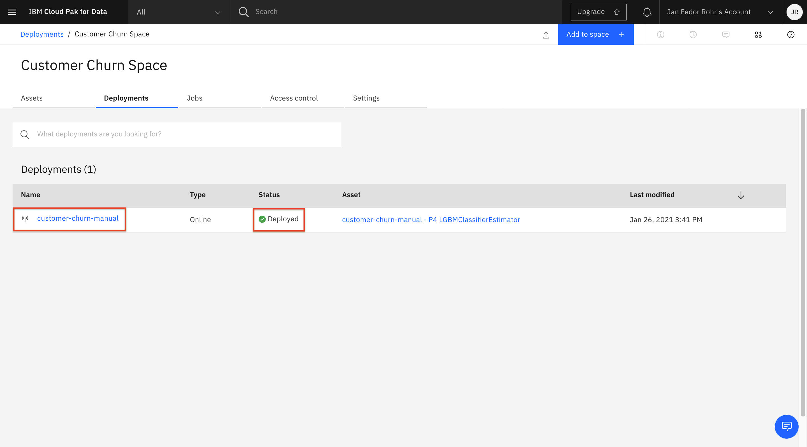

<h1 align="center" style="border-bottom: none;">:bar_chart: IBM Digital Tech Tutorial: Watson Studio Part II</h1>
<h3 align="center">In this hands-on tutorial you will build and evaluate machine learning models by using the AutoAI feature in IBM Watson Studio.</h3>

## Prerequisites

1. Sign up for an [IBM Cloud account](https://cloud.ibm.com/registration).
2. Fill in the required information and press the „Create Account“ button.
3. After you submit your registration, you will receive an e-mail from the IBM Cloud team with details about your account. In this e-mail, you will need to click the link provided to confirm your registration.
4. Now you should be able to login to your new IBM Cloud account ;-)

## Digital Tech Tutorial Watson Studio Part I to IV

This tutorial consists of 4 parts, you can start with part I or any other part, however, the necessary environment is set up in part I.<br>
[Part I - data visualization, preparation, and transformation](https://github.com/FelixAugenstein/digital-tech-tutorial-watson-studio)<br>
[Part II - build and evaluate machine learning models by using the AutoAI](https://github.com/FelixAugenstein/digital-tech-tutorial-watson-studio-part-ii/)<br>
[Part III - graphically build and evaluate machine learning models by using the SPSS Modeler flow](https://github.com/FelixAugenstein/digital-tech-tutorial-watson-studio-part-iii/)<br>
[Part IV - set up and run Jupyter Notebooks to develop a machine learning model](https://github.com/FelixAugenstein/digital-tech-tutorial-watson-studio-part-iv/)

The 4 parts of this tutorial are based on the [Learning path: Getting started with Watson Studio](https://developer.ibm.com/series/learning-path-watson-studio/).

## Create a new AutoAI model

1. Select the Assets tab for your Watson Studio project.
2. In the Asset tab, click the Add to Project command.


3. Select the AutoAI Experiment asset type.
4. In the Create an AutoAI experiment window:

- Select From Blank as the experiment type.
- Enter an Asset Name, such as ‘customer-churn-manual’.
- For the Machine Learning Service, select the Watson Machine Learning service that you previously created for the project. If you have not created one, please do so now. It is available in the IBM Cloud Catalog under the category AI.
- Then click Create.


5. In the Add training data window:

- Click Select from project.
- Select the customer churn data asset previously added to the project (e.g. customer-churn-analysis, don't select any shaped data assets).
- Click Select Asset.


## Run and train the model

From the Configure AutoAI experiment window:

1. In the Select column to predict box, select churn.


2. Keep the default prediction type of Binary Classification, either the optimized metric of ROC AUC (Receiver Operating Characteristics / Area Under Curve) or Accuracy.
3. Click Run experiment.

As the experiment is run, you see the different pipelines in the relationship map. After it finishes, a list of completed models is listed at the bottom of the panel, in order of accuracy. You can also take a look at the Progress map, by clicking swap view.


For our data, Pipeline 4 was ranked the highest, based on our “Area under the ROC Curve” (ROC AUC) metric. After the AutoAI experiment completes, it is saved in the Watson Studio project. You can view it from the Assets tab under AutoAI experiments.

## Evaluate the model performance

On the AutoAI Experiment page, there are a number of options available to get more details on how each pipeline performed.


1. The Pipeline comparison shows different metrics for each pipeline.
2. The > button provides more details about the selected pipeline.
3. Clicking the pipeline name opens the Model Evaluation window for the pipeline.

Inside the Model Evaluation window, there is a menu on the left that provides more metrics for the pipeline, such as: Confusion Matrix table or Feature Importance graph.


The AutoAI Experiment model feature might not provide the exact same set of classification approaches and evaluation metrics as you can get with a Jupyter Notebook, but it arrives at the result significantly faster, and with no programming required.

## Deploy and test the model using Watson Machine Learning service

Using the Machine Learning service of Watson Studio, you can deploy your model in three different ways: as a web service, as a batch program, or as a real-time streaming prediction. In this tutorial, we deploy it as a web service and then test it interactively.

First, you must save the model.

1. For the highest rated pipeline, click Save as model.
2. Keep the default name, and click Save.


The model should then appear in your project Models section of the Assets tab for the project.


To deploy the model, click the model name to open it.

1. Select the Deployments tab.
2. Click Add Deployment.


3. On the Create Deployment page:

- Enter a Name for the deployment (for example, ‘customer-churn-manual-web-deployment’).
- Keep the default Web service Deployment type setting.
- Enter an optional Description.
- Click Save to save the deployment.
- Wait until Watson Studio sets the STATUS field to ‘ready’ or ‘DEPLOY_SUCCESS’.


The model is now deployed and can be used for prediction. However, before using it in a production environment it might be worthwhile to test it using real data. Therefore we will use a JSON object. It’s the most convenient option to perform tests more than once (which is usually the case), and when a large set of feature values is needed.

To make it easier for you, you can cut and paste the following sample JSON object - or use the code in the `test-model.json` file - to use in the following steps:

```
{"input_data":[{"fields": ["state", "account length", "area code", "phone number", "international plan", "voice mail plan", "number vmail messages", "total day minutes", "total day calls", "total day charge", "total eve minutes", "total eve calls", "total eve charge", "total night minutes", "total night calls", "total night charge", "total intl minutes", "total intl calls", "total intl charge", "customer service calls"], "values": [["NY",161,415,"351-7269","no","no",0,332.9,67,56.59,317.8,97,27.01,160.6,128,7.23,5.4,9,1.46,4]]}]}
```

To test the model at run time:

1. Select the deployment that you just created by clicking the deployment name (for example, ‘customer-churn-manual-web-deployment’).



2. This opens a new page showing you an overview of the properties of the deployment (for example, name, creation date, and status).
3. Select the Test tab.
4. Select the file icon, which allows you to enter the values using JSON.
5. Paste the sample JSON object into the Enter input data field.
6. Click Predict to view the results.


The result of the prediction is given in terms of the probability that the customer will churn (True) or not (False). You can try it with other values, for example, by substituting the values with values taken from the ‘customer-churn-kaggle.csv’ file. Another test would be to change the phone number to something like “XYZ” and then run the prediction again. The result of the prediction should be the same, which indicates that the feature is not a factor in the prediction.

## If you have any questions just contact me

Felix Augenstein<br>
Digital Tech Ecosystem & Developer Representative @IBM<br>
Twitter: [@F_Augenstein](https://twitter.com/F_Augenstein)<br>
LinkedIn: [linkedin.com/in/felixaugenstein](https://www.linkedin.com/in/felixaugenstein/)
